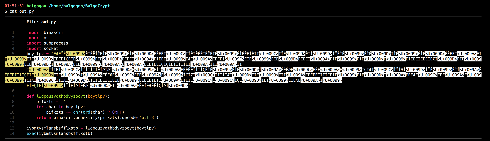

# Balgo Crypter


Balgo Crypter is a Xor encoded payload generation utility with hexadecimal. Balgo Crypter was developed by [Valentin Lobstein](https://github.com/Chocapikk).

## Installation

To install the modules from the requirements.txt file use the following command: 

```sh
git clone https://github.com/Chocapikk/Balgo-Crypter
cd Balgo-Crypter
pip install -r requirements.txt 
```

## Usage

Balgo Crypter can take a reverse shell command and generate a payload from that command.

```sh
python3 balgo_crypter.py -lh <host> -lp <port> -o <output_file>
```
The -m option can be used to specify the encoding method to use for the payload. Currently, **xor** and **base64** are supported.

```sh
python3 balgo_crypter.py -lh <host> -lp <port> -o <output_file> -m <encoding_method>
```

If an input file is specified the reverse shell command will be extracted from that file.

```sh
python3 balgo_crypter.py  -i <input_file> -o <output_file>
```

## Example

Here is an example of the result obtained with Balgo Crypter.

```sh
python3 balgo_crypter.py -lh 127.0.0.1 -lp 1234 -o out.py
```


The **out.py** file will contain the commands given below.



## Acknowledgements

This program is made with help from the [Openai Playground](https://beta.openai.com/playground) project.

